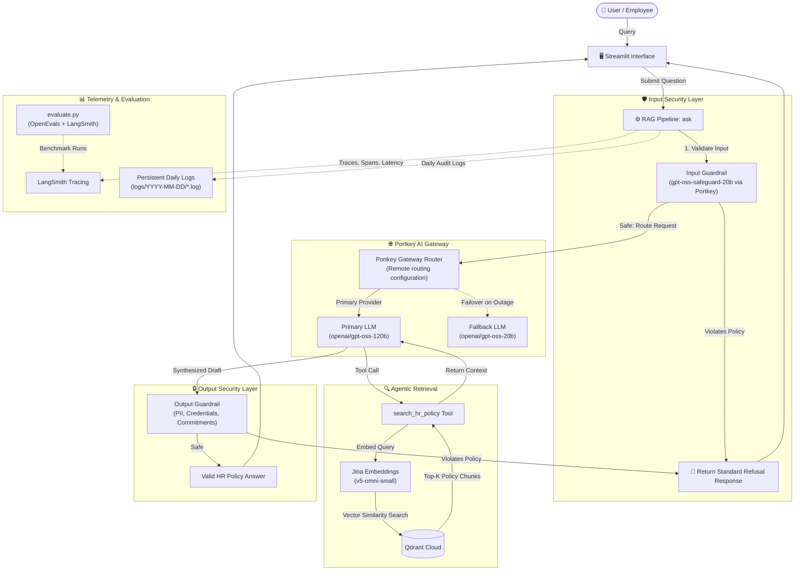

# 🛡️ HR Policy RAG Assistant

[](https://python.org)
[](https://langchain.com)
[](https://openai.com)
[](https://portkey.ai)
[](https://smith.langchain.com)
[](https://qdrant.tech)
[](https://docker.com)
[](https://streamlit.io)


> A security-conscious RAG assistant that answers questions about corporate HR policy. It pairs agentic retrieval with guardrails, gateway-managed LLM routing, evaluation, observability, and an AWS deployment pipeline.

## Overview

The assistant is designed to be more than a prompt wrapper around a vector store. Requests pass through input and output safety checks, use an agent tool to retrieve grounded HR-policy context, and are traced and evaluated as part of the delivery workflow.

- **Security:** defense-in-depth input and output guardrails with structured decisions.
- **Retrieval:** a LangChain agent calls `search_hr_policy` against Qdrant Cloud.
- **Operations:** Portkey routing, LangSmith tracing, persistent daily logs, and LLM-as-a-judge evaluation.
- **Delivery:** Docker, Docker Compose, GitHub Actions, Amazon ECR, and AWS EC2.

## Architecture



## Key Engineering Features

| Area | Implementation |
| :--- | :--- |
| Security | Input and output guardrails using `gpt-oss-safeguard-20b` and structured JSON decisions |
| Agentic RAG | `search_hr_policy` tool, Jina embeddings, Qdrant Cloud, and top-3 retrieval |
| LLM routing | Portkey provider abstraction with gateway-managed primary/fallback routing, retries, and caching |
| Observability | LangSmith traces plus daily persistent application logs |
| Evaluation | OpenEvals and LangSmith LLM-as-a-judge checks for correctness and groundedness |
| Delivery | Docker, Compose `app`/`eval` services, GitHub Actions, ECR, and EC2 deployment |

## How This Differs from a Basic RAG Chatbot

| Dimension | Basic RAG | This project |
| :--- | :--- | :--- |
| Retrieval | Direct similarity lookup | Agentic `search_hr_policy` tool with Qdrant-backed, top-3 retrieval |
| Security | User input and model output pass through unchecked | Dedicated input and output guardrails with structured decisions |
| LLM operations | Direct single-provider calls | Portkey provider abstraction with gateway-managed routing, fallback, retries, and caching |
| Observability | Console output or ad-hoc debugging | LangSmith traces plus persistent daily application logs |
| Quality control | Manual spot checks | OpenEvals/LangSmith correctness and groundedness evaluation on 10 curated cases |
| Delivery | Local script execution | Docker, GitHub Actions validation, ECR image publishing, and EC2 deployment |

## Security & Guardrails

```text
User Input → Input Guard → Agentic RAG → Output Guard → Response
```

- **Classifier:** both guards call `openai/gpt-oss-safeguard-20b` through Portkey.
- **Decision format:** JSON with `violation`, `category`, and `rationale`.
- **Blocked request:** returns a standard safe refusal without continuing through the blocked stage.
- **Input guard:** detects prompt injection and jailbreak attempts, requests to expose system prompts or configuration, unauthorized HR actions, and requests for a colleague's private employee data.
- **Output guard:** checks for PII leakage, credentials or untrusted URLs, system/configuration exposure, and unauthorized corporate commitments such as approving leave.
- **Auditability:** blocked questions and answers are recorded in the application logs with the relevant reason.
- **Execution order:** input screening runs before retrieval and model execution; output screening runs on the agent draft before it reaches the user.

## RAG Architecture

`User Query → Agent Tool → Jina Embedding → Qdrant Similarity Search → Top-3 Chunks → LLM`

- **Agent behavior:** the LangChain agent calls `search_hr_policy` for HR-policy questions and avoids guessing when retrieved context does not contain an answer.
- Source policy text is split with `RecursiveCharacterTextSplitter` using `chunk_size=500` and `chunk_overlap=100`.
- Queries use `jina-embeddings-v5-omni-small` and search the Qdrant Cloud `hr_policy` collection.
- The retriever returns `top-k=3` chunks to ground the answer.
- **Index lifecycle:** startup loads an existing collection or creates it from `data/hr.txt` by splitting and embedding the source policy.
- **Context delivery:** retrieved chunks are returned by the tool to the agent rather than appended unconditionally to every prompt.

## AI Gateway & Resilience

- **Provider abstraction:** Portkey separates the underlying LLM provider, credentials, and traffic policy from the LangChain agent.
- **Model routing:** the gateway configuration routes primary `openai/gpt-oss-120b` calls and can fail over to `openai/gpt-oss-20b`.
- **Resilience:** fallback, retry, and caching policies are gateway-managed and can be changed without rewriting the pipeline.
- **Virtual providers:**
  - `@hrguard` serves input and output guardrail classification.
  - `@judgellm` serves the evaluation judge.

## Observability & Evaluation

- **LangSmith tracing:** with `LANGSMITH_TRACING=true`, records latency, token metadata, agent tool calls, retrieved context, and guardrail activity.
- **Daily application logs:** writes to console and `logs/YYYY-MM-DD/<timestamp>.log`.
- **Logged events:** guardrail blocks, retrieval failures, and pipeline errors.

### LLM-as-a-Judge

- **Dataset:** `hr-policy-qa`, a LangSmith dataset of 10 curated HR-policy question/answer pairs.
- **Frameworks:** OpenEvals and LangSmith.
- **Scores:**
  - **Answer Correctness** against the expected answer.
  - **RAG Groundedness** against the chunks retrieved for that run.
- **Judge:** `openai/gpt-oss-120b`, routed through Portkey with `@judgellm`.
- **Evaluation target:** runs each dataset question through the real assistant and captures retrieval context for groundedness.
- **Regression signal:** correctness identifies answer-quality regressions; groundedness identifies unsupported claims.

## Containerization, Deployment & CI/CD

- **Image:** `python:3.11-slim` with Astral `uv` for dependency installation.
- **Build:** copies the standalone `uv` binary and installs dependencies with `uv pip install --system --no-cache -r requirements.txt`.
- **Runtime:** starts Streamlit with `--server.address=0.0.0.0`.
- **Compose services:** `app` serves Streamlit on port `8501`; `eval` runs `python evaluate.py` under the `tools` profile.
- **Configuration:** Compose loads runtime values from `.env`, keeping credentials out of the image definition.

The deployment path is:

```text
GitHub Push → GitHub Actions → Integration Test → Evaluation → Docker Build → ECR → EC2 → Health Check
```

- **Trigger:** pushes to `main`.
- **Validation:** runs the live integration test and automated evaluation before building an image.
- **Release:** tags the Docker image with the commit SHA and `latest`, then pushes both tags to Amazon ECR.
- **Deployment:** passes runtime configuration from GitHub secrets, deploys the selected image to EC2 over SSH, and starts it with restart protection.
- **Verification:** checks the exposed Streamlit health endpoint.
- **Failure handling:** each job depends on the previous one, so deployment stops when an earlier stage fails.

## Project Structure

```text
.
├── .env.example              # Environment template
├── dockerfile                # Docker image definition
├── docker-compose.yaml       # app and eval services
├── app.py                    # Streamlit interface
├── main.py                   # CLI runner
├── evaluate.py               # Evaluation entry point
├── data/hr.txt               # Source HR policy
├── hr_assistant/
│   ├── config.py             # Environment and settings
│   ├── guardrails.py         # Input/output safety checks
│   ├── gateway.py            # Portkey client
│   ├── llm.py                # LLM factory
│   ├── document_loader.py    # Policy loader
│   ├── doc_splitter.py       # Chunking
│   ├── embeddings.py         # Jina embeddings
│   ├── vector_store.py       # Qdrant integration
│   ├── tools.py              # search_hr_policy tool
│   ├── agent.py              # LangChain agent
│   ├── pipeline.py           # RAG pipeline
│   ├── logger.py             # Daily logging
│   ├── tracing.py            # LangSmith configuration
│   └── evaluation.py         # Evaluators and dataset setup
└── tests/test_ask.py         # Live integration test
```

## Quickstart

```bash
git clone https://github.com/urshashi09/HR-Policy-RAG-assistant.git
cd HR-Policy-RAG-assistant

python -m venv venv
# Linux/macOS
source venv/bin/activate
# Windows
# venv\Scripts\activate

pip install uv
uv pip install -r requirements.txt
```

Copy `.env.example` to `.env` and provide the required credentials and service configuration:

```bash
cp .env.example .env
```

Windows PowerShell:

```powershell
Copy-Item .env.example .env
```

Run the application locally:

```bash
streamlit run app.py
```

Or start it with Docker Compose:

```bash
docker compose up --build app
```

Open `http://localhost:8501`.

## Testing & Evaluation

```bash
# Live integration test; requires configured cloud credentials
pytest tests/

# Run the evaluation locally
python evaluate.py

# Or run the evaluation service in Compose
docker compose --profile tools run eval
```
